1

1  # **INTRODUCTION** 
in today's world, technology is becoming increasingly important and consumers are looking for convenience when shopping for technology products, especially mobile phones. That's why our mobile retail store has introduced an advanced app developed with Node.js, which helps create a unique and convenient shopping experience for customers. The smart search feature makes it easy for customers to choose the right phone for their individual needs. From the latest models to exclusive products that are only available on our store website, the app offers great variety and choice.

1  # **TECHNOLOGY USED IN APPLICATION**
Technology used:

- **Fronted:** Use HTML, CSS, and JavaScript.
- **Backend**: Use a programming language Node.js uses frameworks stored in package.json .

`    	`**"ejs": "^3.1.9",**	

`    	`**"express": "^4.18.2",**

`  	 `**"express-flash": "^0.0.2",**

`   	 `**"express-session": "^1.17.3",**

`   	 `**"jsonwebtoken": "^9.0.2",**

`   	 `**"mongoose": "^8.0.1",**

`   	 `**"multer": "^1.4.5-lts.1",**

`   	 `**"nodemailer": "^6.9.7",**

`   	 `**"path": "^0.12.7",**

`   	 `**"pdfkit": "^0.14.0"**

- **Database**: Using a NoSQL database (MongoDB) for storage 

1  # **DESIGN ANALYSIS**
   1. ## **Diagram**
      1. ### ***Class diagram***
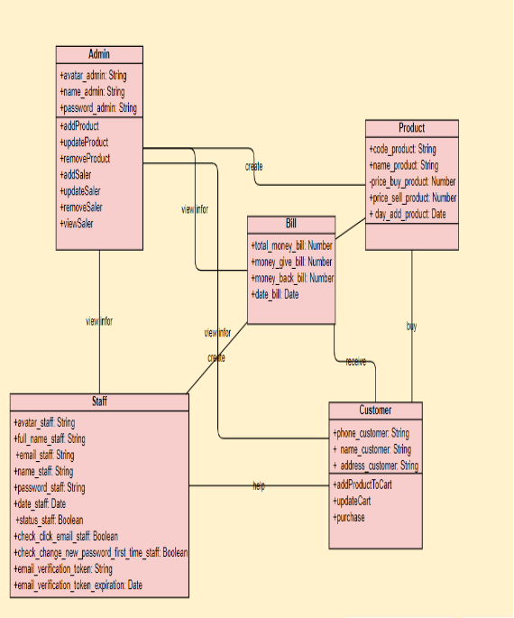

**Figure 3.1.1 Class diagram**
1. ### ***Usecase diagram***
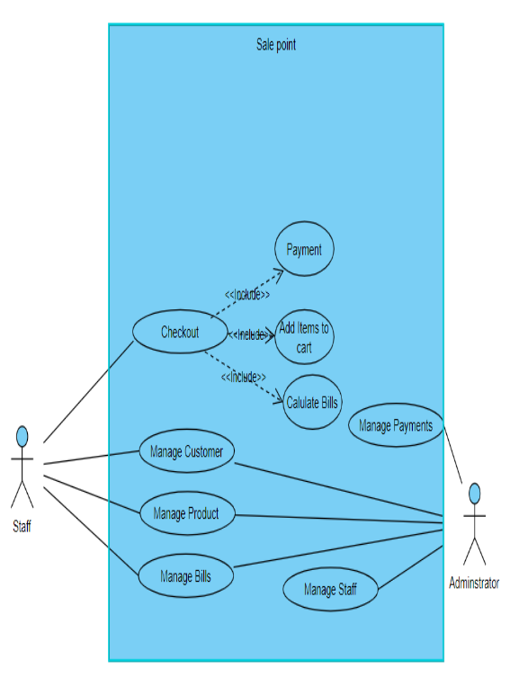

**Figure 3.1.2 Usecase diagram**

1. ### ***Sequence diagram***
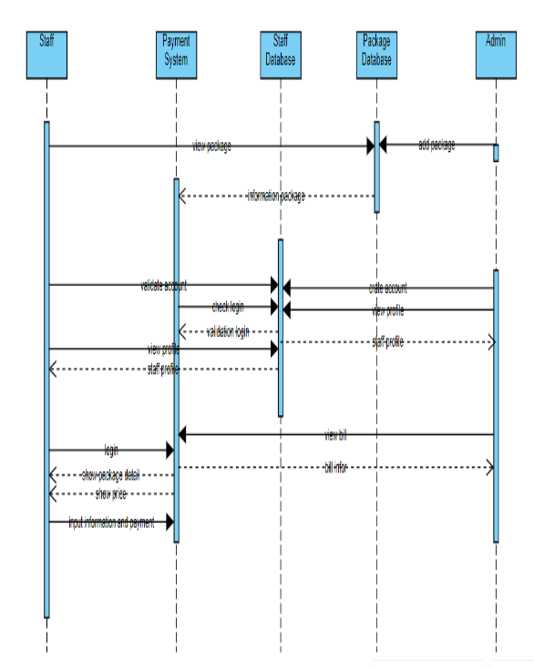

**Figure 3.1.3 Sequence diagram**

1. ### ***Functional decomposition diagram***
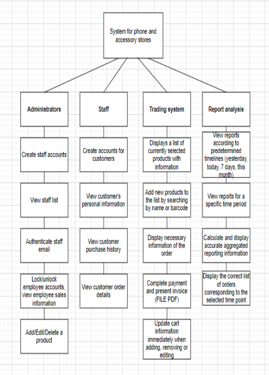

**Figure 3.1.4:  Functional decomposition diagram**
1. ## **Source code** 
   1. ### ***Directory structure***
- **env :** contains the path to the environment in which the product is run
- **App.js :** is an important file, responsible for connecting everything so that the application can run correctly. 
- **package. json:** The package.json file contains crucial information and configurations related to the development, packaging, and deployment processes. 
- **config:** db.js(database) container
- **node\_modules:** This is a  directory in the my NodeJS project . It contains the NodeJS modules used in the project. These modules are libraries or tools required for the project to run
- **src:** This is a directory in the NodeJS project typically contains the source code files of the application following **MVC model** . It's where you organize your code and assets for my application. Let's break down the likely content of each subdirectory:
  - **Controllers:** Get created to execute requests from users, receive parameters, call functions in the model, load the necessary views
  - **Middleware:** Provides services from the operating system side to applications, making it possible for applications to interact with components allowed by the operating system.
  - **models:** Contains all files that define the models of the application
  - **public:** Contains static files, such as images, CSS files, JavaScript files, …  or other static resources to serve directly to the client from the web server.
  - **routes:** Contains files that define routes for the application.
  - **views:** Contains files that define the user interface using the template engine

1. ## **Deploy application**
Deploy steps by steps:

**Step 1:** Create reponsitory on Github: paymentshop-app. Then push the code to Github: <https://github.com/xianfuhui/paymentshop-app>

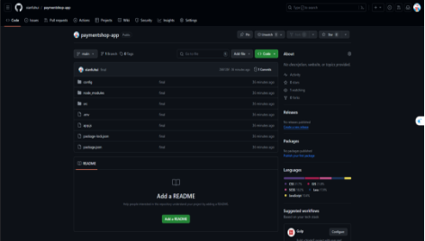

**Figure 3.3.1: Creating repository**

**Step 2:** Create MongoDB Atlas and write the information in .env file of the source code

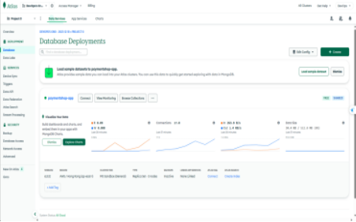

**Figure 3.3.2: Creating MongoDB Atlas**

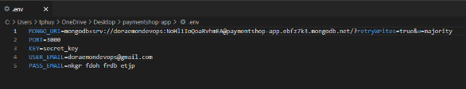

**Figure 3.3.3 Update .env file**

**Step 3:** Use <https://render.com/> to deploy code

- Connect to code packaged on GitHub in previous step

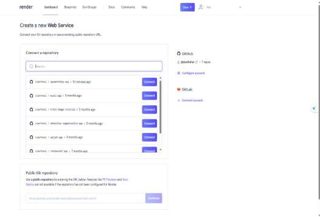

**Figure 3.3.4: Reponsitory connection**

- Detail configuration settings: 
  - **Name:** paymentshop-app
  - **Region:** Oregon (US West)
  - **Branch:** main
  - **Root Directory:** “.”
  - **Runtime:** Node 
  - **Build Command:** yarn
  - **Start Command:** npm start

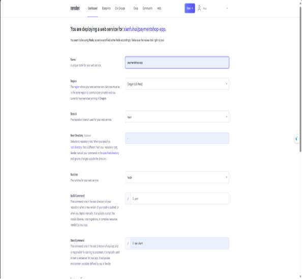

**Figure 3.3.5: Details Configuration Settings for Render**

- The display screen has been successfully deployed

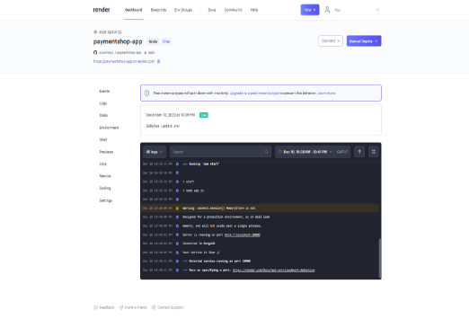

**Figure 3.3.6: Logs success notification**

**Step 4:** Check result at https://paymentshop-app.onrender.com/

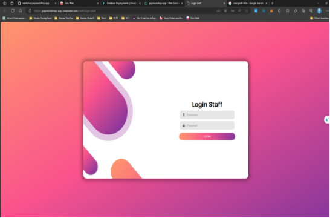

**Figure 3.3.7 Application after deploy successfully**
1. ## **Application overview**
   1. ### ***UI/UX Admin site***
- **Login feature for Admin**

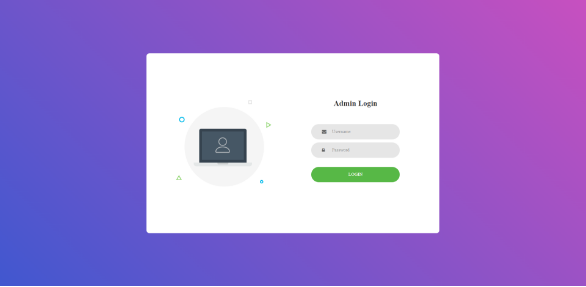

**Figure 3.4.1: Login interface for Admin** 

- Profile feature Admin 

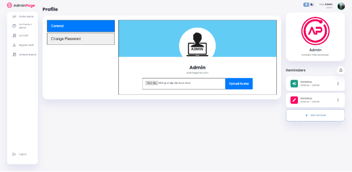

**Figure 3.4.2: Profile admin page** 

- **Change password feature for admin**

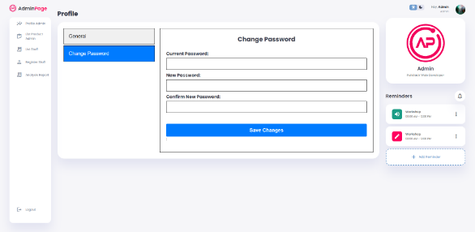

**Figure 3.4.3: Change password page**

- **Create account staff feature for Admin**

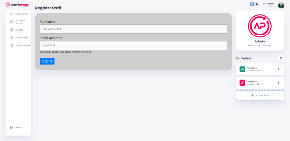

**Figure 3.4.4: Register for account staff page**

- **List of staffs feature for Admin**

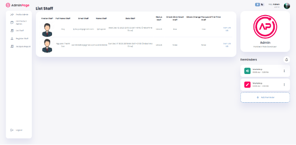

**Figure 3.4.5 List of staffs page**

- **View employee details feature for Admin**

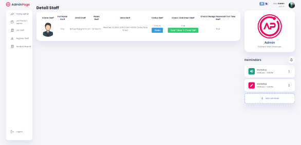

**Figure 3.4.6 View staff details page**

- **Manage product feature for Admin**

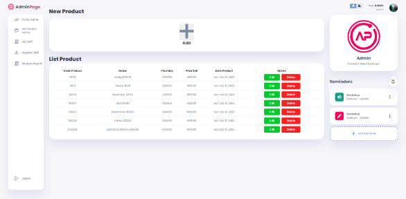

**Figure 3.4.7 List of product page**

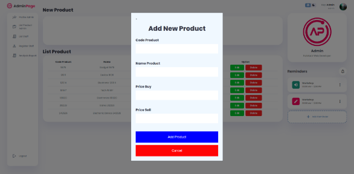

**Figure 3.4.8 Add product page**

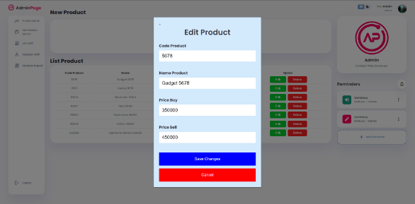

**Figure 3.4.9 Edit product page**

- **Analysis reports feature for Admin**

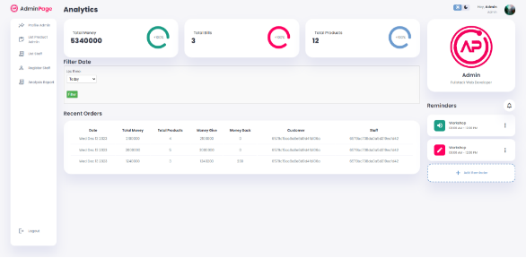

**Figure 3.4.10 Analysis reports page**

1. ### ***UI/UX Staff site***
- **Login feature for Staff**

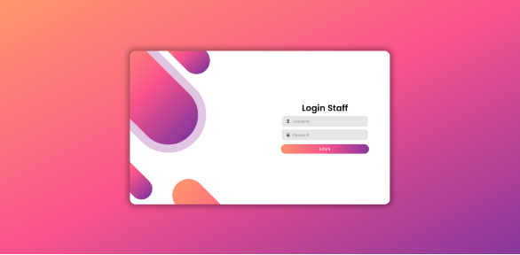

**Figure 3.4.11 Staff login page**

- **Profile feature for Staff** 

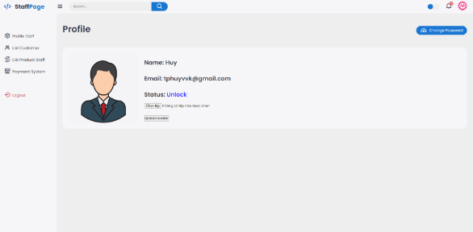

**Figure 3.4.12 Profile staff page**

- **Manager customer**

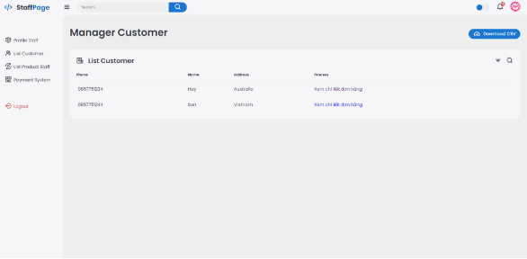

**Figure 3.4.13 List customer page**

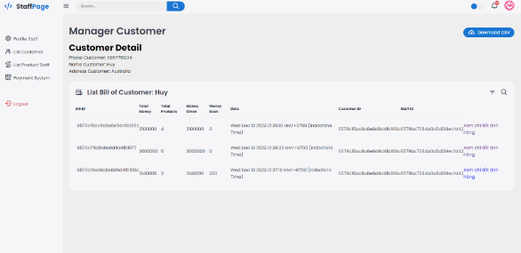

**Figure 3.4.14 Customer details page**

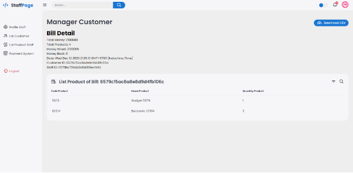

**Figure 3.4.15 List product page**

- **Cart feature for Staff** 

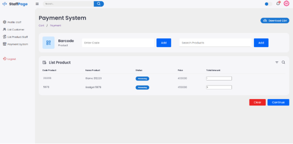

**Figure 3.4.16 Cart page**

- **Payment feature for Staff**

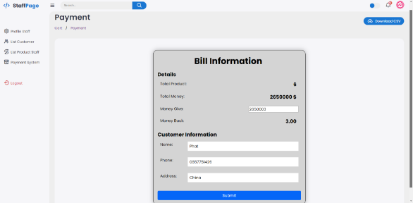

**Figure 3.4.17 Payment page**

###

##

1  # **SUMMARY**
We have completed all requirements and deployed the website on Render at https://paymentshop-app.onrender.com/ thanks to the guidance of Mai Van Manh teacher. 
